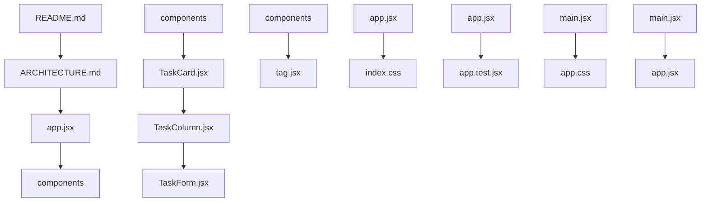

# System Architecture

```mermaid
graph TD
    A[README.md] --> B[ARCHITECTURE.md]
    B --> C[app.jsx]
    C --> D[components]
    E[components] --> F[TaskCard.jsx]
    F --> G[TaskColumn.jsx]
    G --> H[TaskForm.jsx]
    I[components] --> J[tag.jsx]
    K[app.jsx] --> L[index.css]
    M[app.jsx] --> N[app.test.jsx]
    O[main.jsx] --> P[app.css]
    Q[main.jsx] --> R[app.jsx]
```

> Generated by AppGenius Sentinel